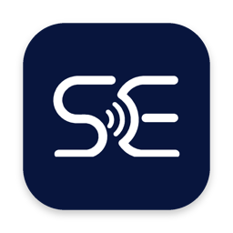

> **Note:** The team is now building **[char](https://char.com)**. The **anarlog** community application remains open-source, MIT-licensed, and maintained as the local-first meeting notetaker in this repo.

<div align="center">

  

  <h1>anarlog</h1>

  <p>
    <b>The privacy-first AI meeting notepad.</b>
    <br />
    Open source, local-first, and yours to fork. Granola, rearranged.
  </p>

  <p>
    <a href="https://anarlog.so">Website</a>
    &nbsp;•&nbsp;
    <a href="https://docs.anarlog.so">Docs</a>
    &nbsp;•&nbsp;
    <a href="https://anarlog.so/download">Download</a>
    &nbsp;•&nbsp;
    <a href="https://anarlog.so/discord">Discord</a>
    &nbsp;•&nbsp;
    <a href="https://www.reddit.com/r/anarlog/">r/anarlog</a>
    &nbsp;•&nbsp;
    <a href="https://x.com/anarlogapp">@anarlogapp</a>
    &nbsp;•&nbsp;
    <a href="https://status.anarlog.so">Status</a>
  </p>

  <p>
    <a href="https://github.com/fastrepl/anarlog/stargazers"></a>
    <a href="LICENSE"></a>
    <a href="https://anarlog.so/discord"></a>
    <a href="https://deepwiki.com/fastrepl/anarlog"></a>
  </p>

  

</div>

<br />

anarlog is an open-source alternative to Granola. It takes notes in your meetings without sending a bot to join the call: it listens to your device audio, can transcribe on your machine, and keeps app data in a local SQLite database.

It is built for people who want AI meeting notes without handing their conversations to someone else's cloud, and for anyone who needs to get a notetaker past a security review with a straight face.

## Why anarlog

- **No bot joins your call.** anarlog captures audio directly on your device. Nothing appears in the participant list, and nothing records from inside the meeting.
- **Local when you choose it.** On supported Macs, available built-in transcription models run on-device. Local Intelligence providers keep summaries and chat on your computer too.
- **Your data, in a format you can read.** Sessions, notes, and transcripts live in local SQLite. Recordings and attachments are plain local files. Export Markdown whenever it fits your workflow.
- **Bring your own AI.** Use a supported hosted provider, your own API key, or an OpenAI-compatible local server such as Ollama, LM Studio, or Unsloth.
- **Readable source, MIT.** The community application is MIT-licensed. Fork it, audit it, sell it, or build it yourself.
- **Cloud is opt-in, not required.** Hosted AI, encrypted CloudSync, and sharing exist when you want them. Nothing depends on them.

## What runs where

| Part of the workflow | Where it happens |
| --- | --- |
| Audio capture and recording | Your device |
| Transcription | Your device with an on-device model, or the provider you select |
| Notes and transcript storage | Local SQLite plus local files |
| AI summaries and chat | Your choice: local model, your own API key, or optional hosted AI |
| Sync and sharing | Off by default, opt-in encrypted CloudSync |

## How AI works

anarlog keeps audio transcription separate from the language model used for summaries and chat. You can change either one without changing the other.

| Stage | App setting | Anarlog Cloud | Local or bring your own |
| --- | --- | --- | --- |
| Audio → transcript | **Transcription** | A managed route chooses by language and live or batch mode. Current primary paths include Deepgram Nova and Soniox 5. | Soniqo or Apple Speech when available, or your selected transcription provider and model |
| Transcript + memo → summary, title, or chat | **Intelligence** | Auto currently uses the latest Claude Sonnet alias through OpenRouter. | Your selected API, subscription, OpenAI-compatible server, or eligible Apple Intelligence |

The active provider and model are always visible under **Settings → Transcription** and **Settings → Intelligence**. Read [Models and providers](https://docs.anarlog.so/models-and-providers) for the current routes, local model list, and privacy boundaries.

## Get started

1. [Download Anarlog](https://anarlog.so/download) for macOS, Windows, or Linux.
2. Open it and join a meeting. anarlog records on your device and transcribes with the model you selected.
3. Generate a note, edit it like a document, and export Markdown when you need it.
4. Optional: connect an LLM provider or a local model in settings for summaries and chat.

Product docs live at [docs.anarlog.so](https://docs.anarlog.so). To build the desktop app or website from source, follow [Local development](#local-development).

## Repository map

| Path | What lives there |
| --- | --- |
| `apps/desktop` | Tauri v2 desktop app: React and TypeScript UI, Rust backend |
| `apps/web` | anarlog.so website, account portal, and shared-note pages; not the desktop notepad |
| `apps/api` | Optional hosted services for AI, sync, sharing, and integrations |
| `apps/cli` | Local CLI and MCP server |
| `apps/mobile` | Mobile client source; no mobile app is currently distributed |
| `apps/stripe` | Billing integration |
| `apps/watch/apple` | watchOS companion source built with the mobile app |
| `plugins/*` | Tauri capabilities such as local STT, database access, calendar, export, and notifications |
| `crates/*` | Rust libraries for audio capture, transcription, diarization, storage, and services |
| `packages/*` | Shared TypeScript packages for the editor, database, UI, and plugin SDK |
| `supabase/` | Hosted authentication, sharing, sync, billing, and Cloud API data |
| `skills/anarlog` | Published agent skill for the CLI and MCP server |

## Local development

The local-first desktop app and website start without secrets. Hosted AI, CloudSync, authentication, billing, and connected integrations need their optional local services and configuration.

You need Node.js 22 or later, pnpm 11.1.1, Rust 1.94.0, and the [Tauri v2 system dependencies](https://v2.tauri.app/start/prerequisites/). On Debian or Ubuntu, the repository can install the required toolchains and system packages:

```bash
bash scripts/setup-linux.sh
```

Install the workspace and start the app you want to work on:

```bash
pnpm install --frozen-lockfile
pnpm exec turbo dev:desktop
# or
pnpm exec turbo dev:web
```

Read [CONTRIBUTING.md](CONTRIBUTING.md) for validation commands, code ownership, and the contribution workflow. Ask [DeepWiki](https://deepwiki.com/fastrepl/anarlog) for a code-indexed explanation of a subsystem.

## Name history

**anarlog** started as **Hyprnote**, then briefly used the **char** name.

We later split the work into two projects. **[char](https://char.com)** is the team's current productivity app. **anarlog** is this open-source, local-first meeting notetaker.

This repository is not the current char codebase, and anarlog is not being retired. Its community application stays MIT-licensed, forkable, buildable from source, and built for local notes you control.

If you came here from Granola, welcome. If you came here from Hyprnote, welcome back.

Either way, it's yours.

## Contributing

Issues, pull requests, bug reports, and docs fixes are all welcome.

- Read [CONTRIBUTING.md](CONTRIBUTING.md) before opening a pull request.
- Join the community on [Discord](https://anarlog.so/discord) or [r/anarlog](https://www.reddit.com/r/anarlog/).

## License

- Community application: [MIT](LICENSE)
- Full boundary: [LICENSING.md](LICENSING.md)

Maintained by [fastrepl](https://github.com/fastrepl).

## Contributors

<a href="https://github.com/fastrepl/anarlog/graphs/contributors">
  
</a>
